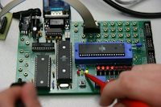
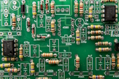
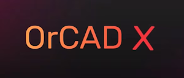
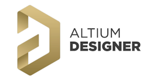

  $${\color{#28bd45}\huge\textbf{Viver a vida é arte, dividir é uma dádiva.}}$$

  

   

---
 

  $${\color{#fc0303}\Large\textbf{😇  Take ease! 😜}}$$

---
 

$${\color{#00bfbf}\large\textbf{Estatísticas:}}$$

#
 

$${\color{#00bfbf}\large\textbf{Habilidades Principais:}}$$

 &nbsp;&nbsp; 

 

___

$${\color{#00bfbf}\large\textbf{Ferramentas:}}$$

 &nbsp;&nbsp; &nbsp;&nbsp; &nbsp;&nbsp;

 

___

$${\color{#00bfbf}\large\textbf{Outros conhecimentos:}}$$

 &nbsp;&nbsp; 
=======
  
#
$${\color{#00bfbf}\large\textbf{Outros conhecimentos:}}$$
>>>>>>> 81ceb3cbbc22f29351206cfd9281fb2fc329c2f2

  

___
$${\color{#00bfbf}\large\textbf{Estou estudando esses no momento:}}$$

 
 

  

---   

 

$${\color{#00bfbf}\large\textbf{Temas para Técnicos em Eletrônica:}}$$

<a href="assets/documents/ProtocoloParaEletronica.pdf">📄 Protocolo Técnico (PDF)</a>

  

---
 

  

  

